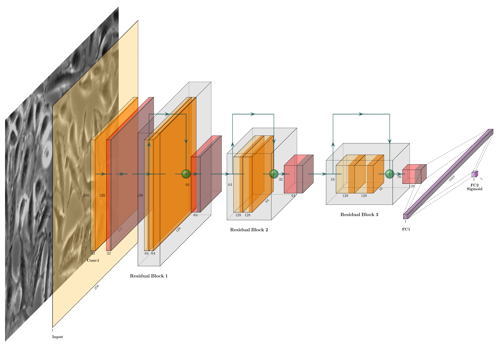

# check_biocells_status

A simple residual block structure is introduced in the CNN (plotted in a seperate docker plotnn):



The dataset for training the model is compressed and encrypted. 

### Environment

* Jetson Orin NX 16GB (Ubuntu 20.04 LTS)
* Dokcer Container: [NVIDIA L4T ML, JetPack 5.1 (L4T R35.2.1)](https://catalog.ngc.nvidia.com/orgs/nvidia/containers/l4t-ml)

### Usage

In terminal:
```
git clone https://github.com/lightinfection/cell_recognition.git && cd cell_recognition
sudo docker build -t cell:pcm .
sudo docker run -it --rm --runtime nvidia --gpus all --network host cell:pcm
cd /home/cell_recognition/ && 7z x -p{PASSWORD} data_encrypted.zip
python3 train.py
```
